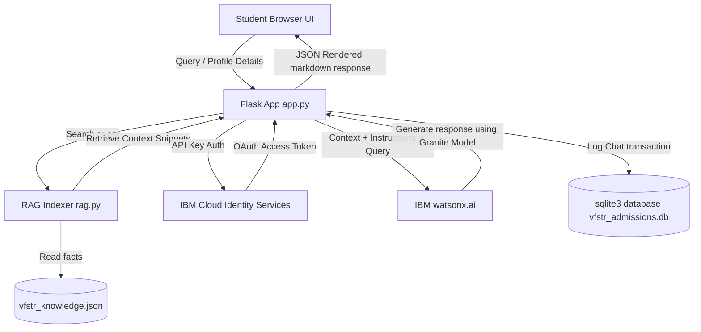

# VFSTR Smart College Admission Assistant & Portal

An enterprise-grade, responsive AI-powered admission assistant and student dashboard portal for **Vignan's Foundation for Science, Technology & Research (VFSTR)**. The backend is built using **Python Flask**, with an integrated Retrieval-Augmented Generation (RAG) system matching user queries to official university policies, and executing AI text generation via **IBM watsonx.ai** using **IBM Granite Models**.

---

## 🚀 Key Features

*   **RAG AI Chatbot**: Converses with prospective students regarding tuition fees, scholarships, hostel amenities, placement stats, and campus clubs, with a local-fallback system for demo evaluation.
*   **Speech-to-Text & Text-to-Speech**: Speech capture and audio voice playback inside the chat bubbles for enhanced mobile accessibility.
*   **Personalized Course Recommendations**: Evaluates student interest, high school GPA, and entrance exam marks to output specific eligible programs.
*   **Admissions Dashboard & Timeline Tracker**: Tracks key events like counseling slots, registration deadlines, and required document checklists.
*   **Scholarship Fee Estimator**: Automatically matches class 12 percentages and entrance ranks to correct scholarship slabs.
*   **Admin Panel**: Allows administrators to view chat transaction logs, telemetry statistics, and insert custom FAQ rules into the SQLite database.
*   **Premium Glassmorphic Design**: Sleek dark/light toggles, glowing components, Chart.js integrations, and fully responsive layouts.

---

## 🛠️ Architecture Overview



---

## 📦 File Folder Structure

The project conforms to the following layout:
```
SMART/
├── app.py                     # Application Factory & Startup Script
├── routes.py                  # View Controllers & REST API Blueprints
├── services.py                # Admission Logic & Eligibility Computations
├── watsonx.py                 # IBM watsonx.ai API Client & Demo Simulator
├── rag.py                     # Term-Frequency / Keyword Retrieval Search Engine
├── config.py                  # Configurations & Env variables Loader
├── AGENT_INSTRUCTIONS.py      # Customizable Bot Personality & Tone Rules
├── database.py                # SQLite3 Database schemas & transactions
├── vfstr_knowledge.json       # Structured Knowledge Base (Courses, Fees, Hostels)
├── requirements.txt           # Python Project dependencies
├── .env                       # Local secrets credentials file (ignored by Git)
├── .env.example               # Template file for credentials
├── README.md                  # Setup & Deployment Instructions
├── static/
│   ├── css/
│   │   └── style.css          # Custom Glassmorphic Stylesheet
│   └── js/
│       └── app.js             # Client scripts, Charts, Form controllers
└── templates/
    └── index.html             # Dashboard markup template
```

---

## ⚡ Setup & Installation

### 1. Prerequisites
Ensure you have **Python 3.9** or higher installed.

### 2. Clone the repository and install dependencies
Open your command terminal inside the project directory and run:
```bash
pip install -r requirements.txt
```

### 3. Setup IBM watsonx.ai credentials (Optional)
To query live Watsonx models, obtain credentials:
1. Log in to [IBM Cloud](https://cloud.ibm.com).
2. Go to **Manage > Access (IAM) > API Keys** and click **Create an IBM Cloud API key**.
3. Create a **watsonx.ai** service instance and retrieve the project ID from your watsonx project settings.
4. Rename `.env.example` to `.env` and paste your credentials:
```env
IBM_WATSONX_API_KEY=your_ibm_cloud_api_key
IBM_WATSONX_URL=https://us-south.ml.cloud.ibm.com
IBM_PROJECT_ID=your_watsonx_project_id
```

*Note: If these variables are blank or not set, the application will run in **Demo Mode** using high-fidelity simulated Granite responses directly from the knowledge base, ensuring zero setup issues during evaluation.*

---

## 🏃 Running the Application

Start the Flask development server:
```bash
python app.py
```
After the logs verify the database initialization, navigate to your web browser:
👉 **[http://127.0.0.1:5000](http://127.0.0.1:5000)**

---

## ☁️ Deployment Instructions

### Option 1: Deploy to IBM Cloud Code Engine (Recommended)
You can deploy containerized Python Flask applications directly to **IBM Cloud Code Engine**:
1. Install the IBM Cloud CLI and login:
   ```bash
   ibmcloud login --sso
   ibmcloud target -g Default
   ```
2. Target the Code Engine plugin:
   ```bash
   ibmcloud plugin install code-engine
   ```
3. Build a container or push directly from source using the IBM Cloud builder:
   ```bash
   ibmcloud ce application create --name vfstr-admission-assistant --build-source . --env IBM_WATSONX_API_KEY=your_api_key --env IBM_PROJECT_ID=your_project_id
   ```

### Option 2: Production deploy with Gunicorn
To launch in a production Linux VPS environment (e.g. Heroku, DigitalOcean, or AWS EC2), run the WSGI application factory container with:
```bash
gunicorn "app:create_app()" -b 0.0.0.0:8080
```
Ensure you have saved the environment variables inside your server control panel settings.
